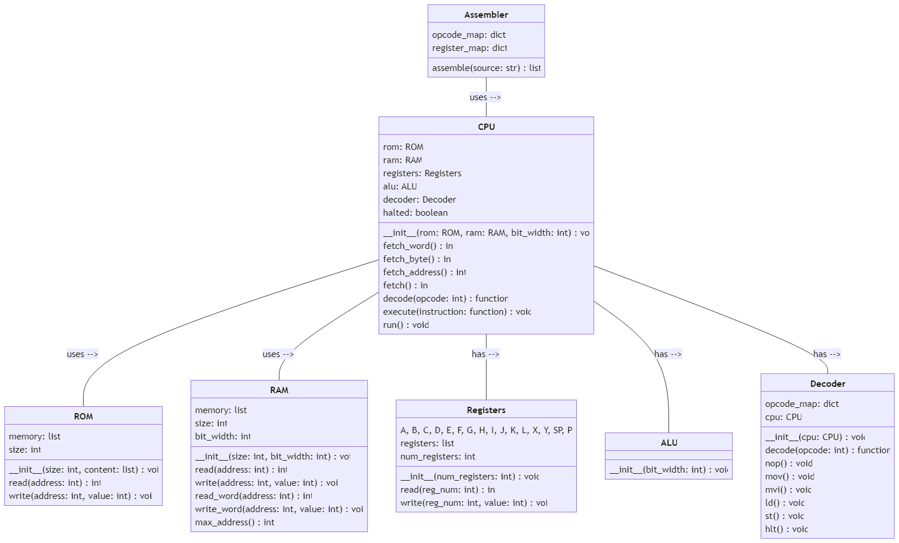

# python_8bit_cpu

This is a simple (in progress) CPU simulator, which mimics the behavior of a computer's CPU.    

 

## alu.py

The ALU class provides arithmetic and logical operations for the CPU. It supports operations like addition, subtraction, multiplication, division, bitwise AND, bitwise OR, bitwise XOR, bitwise NOT, left and right shifts, rotations, as well as comparison operations. 
Results are masked to the bit width (8 bits by default). Each operation updates the flags, whose bits are defined in the <code>Flags</code> class:

| Flag | Bit |
| --- | --- |
| <code>Flags.ZERO</code> | 0x01 |
| <code>Flags.CARRY</code> | 0x02 |
| <code>Flags.OVERFLOW</code> | 0x04 |
| <code>Flags.SIGN</code> | 0x08 |

When the ALU belongs to a CPU, the flags are stored in the <code>F</code> register, so conditional jumps such as <code>jc</code> see the result of the last arithmetic or compare operation. A standalone <code>ALU()</code> keeps them in its own <code>flags</code> attribute. 

## cpu.py

The CPU class takes a ROM object as input. The object contains the instructions that the CPU will execute, and a RAM object, which represents the computer's memory (including the stack).  
It has a set of Registers, which hold data that the CPU needs to perform its operations and it has an ALU object and a Decoder object that it uses to execute instructions. 

The CPU class has a <code>fetch</code> method, which fetches the next byte from ROM and advances PC. It also has a decode method, which decodes the byte into an instruction function.  
It has an execute method, which executes the instruction returned by the decode method. 

The <code>run</code> method performs a single fetch-decode-execute cycle. Call it in a loop until the CPU's <code>halted</code> attribute becomes True, which the "hlt" instruction sets:

<pre>
while not cpu.halted:
    cpu.run()
</pre>

A <code>fetch_byte</code> method fetches the next byte from ROM, and a <code>fetch_word</code> method fetches the next two bytes and combines them into a single 16-bit value. 

### Debugging
These methods power the command-line runner and the planned Brassboard dashboard:

| Method | What it does |
| --- | --- |
| <code>step()</code> | Runs one instruction and returns a <code>StepRecord</code>: <code>address</code>, decoded <code>instruction</code>, <code>register_writes</code> and <code>ram_writes</code> as <code>(old, new)</code>, <code>next_address</code>, <code>jumped</code>, <code>halted</code>. Raises <code>RuntimeError</code> on a halted CPU. |
| <code>run_until(max_steps=100000, on_step=None)</code> | Steps until the CPU halts, reaches an address in <code>cpu.breakpoints</code>, or hits the step limit. Returns a <code>RunResult</code> whose <code>reason</code> is <code>halted</code>, <code>breakpoint</code> or <code>step_limit</code>. A breakpoint stops before its instruction runs; calling again continues past it. |
| <code>undo(record)</code> | Reverses the most recent <code>step()</code> using the old values in its <code>StepRecord</code>. |
| <code>snapshot()</code> / <code>restore(snapshot)</code> | Capture and restore registers, RAM, halt state and <code>cycles</code>. |
| <code>reset()</code> | Clears registers and RAM and sets SP to the top of RAM. Breakpoints are kept. |

<code>StepRecord</code>, <code>RunResult</code> and <code>Snapshot</code> live in <code>trace.py</code>, along with <code>format_record()</code> for one-line trace output.

## disassembler.py
<code>disassemble(code, address)</code> decodes the instruction at an address into an <code>Instruction</code> (<code>mnemonic</code>, <code>operands</code>, <code>bytes</code>, <code>size</code>), and <code>disassemble_all(code)</code> decodes a whole program. <code>Instruction.text(labels)</code> formats it back to assembly, such as <code>jnz, C, loop</code>. Invalid bytes raise <code>DisassemblerError</code>. 

## Command-line runner
Run a program from the repository root:

<pre>
python3 -m src run examples/fibonacci.asm --trace
</pre>

| Option | Meaning |
| --- | --- |
| <code>--trace</code> | Print one line per instruction: cycle, address, bytes, instruction and its effect |
| <code>--break LOCATION</code> | Stop before the instruction at a label or address (<code>next</code>, <code>0x0018</code>); repeatable |
| <code>--max-steps N</code> | Stop after N instructions (default 100000) |
| <code>--ram BYTES</code> | RAM size (default 1024) |

<code>python3 -m src disasm PROGRAM</code> prints the assembled program with addresses, bytes and labels. 
Exit codes: 0 halted or stopped at a breakpoint, 1 assembler or runtime error, 2 invalid arguments, 3 step limit reached. 

The <code>examples/</code> folder has programs to try: <code>countdown.asm</code>, <code>multiply.asm</code>, <code>factorial.asm</code>, <code>gcd.asm</code>, <code>bitcount.asm</code>, <code>swap.asm</code> and <code>fibonacci.asm</code>. CI runs all of them. 

## Brassboard dashboard
**Open it in your browser: https://pyshadi.github.io/python_8bit_cpu/** — nothing to install. Write or pick a program, set breakpoints, step or run it, and watch the registers, memory (RAM map, hex dump, stack and ROM) and the trace. RAM can be 1 KB, 4 KB or 64 KB. A data-path diagram shows what the next instruction will do before it runs, Back and clicking a trace row undo the last 1,000 instructions and edits, and register, flag and memory values can be edited in place. Your own programs are saved in the browser and can be downloaded or shared as a link that contains the program. The theme follows your system or can be switched to light or dark. The Manual tab explains every control.

The dashboard runs this repository's Python code in the browser with [Pyodide](https://pyodide.org). It lives in <code>dashboard/</code>:

| File | Role |
| --- | --- |
| <code>index.html</code> | Page layout, styles and the Manual |
| <code>app.js</code> | Editor, controls, registers and trace |
| <code>worker.js</code> | Loads Pyodide and <code>src/</code> in a Web Worker and runs the emulator at the chosen clock rate |
| <code>manifest.json</code> | Pyodide version, and the Python files and examples to load (a test keeps it in sync with the repo) |

The page talks to <code>src/session.py</code>, a small JSON command interface (<code>load</code>, <code>step</code>, <code>run</code>, <code>reset</code>, <code>set_breakpoints</code>, <code>state</code>) that is tested like the rest of the emulator. Every push to <code>main</code> runs the tests and deploys the dashboard to GitHub Pages (<code>.github/workflows/pages.yml</code>).

To work on the dashboard itself, serve the repository folder and open <code>http://localhost:8000/dashboard/</code>:

<pre>
python -m http.server 8000
</pre>

## registers.py

The Registers class has a <code>read</code> method, which takes a register index and returns the value stored in that register. It also has a write method, which takes a register index and a value, and stores that value in the specified register. Invalid indices raise an <code>IndexError</code>. 
It defines constants for register indices: <code>A, B, C, D, E, F, G, H, I, J, K, L, X, Y, SP,</code> and <code>PC</code>. These constants can be used in place of raw register indices to make the code more readable. 

<code>F</code> is the flags register and is overwritten by every ALU operation, so don't use it for general-purpose storage. 
General-purpose registers and <code>F</code> are 8-bit; <code>SP</code> and <code>PC</code> are 16-bit. Written values wrap around, so decrementing 0 gives 255. 

The Registers class has a registers attribute, which is a list of register values. It also has a <code>num_registers</code> attribute, which indicates the number of registers in the set.  
By default, the Registers class initializes with sixteen registers. 

## memory.py

### ROM
The ROM contains the instructions that the CPU will execute. It takes as input a <code>size</code> parameter, which represents the size of the ROM in bytes, and an optional <code>content</code> parameter, which is a list of bytes representing the initial contents of the ROM. 

The ROM class has a <code>read</code> method, which reads a byte from memory at the specified address. It also has a <code>write</code> method, which raises a RuntimeError because ROM is read-only.  

### RAM
The RAM class takes as input a <code>size</code> parameter, which represents the size of the RAM in bytes, and an optional <code>bit_width</code> parameter. 
The <code>read</code> method reads a byte from memory at the specified address. It also has a write method, which writes a byte to memory at the specified address. 
The RAM class also has <code>read_word</code> and <code>write_word</code> methods, which are used to read and write 16-bit words to memory. These methods are useful for working with data types that are larger than a single byte. 
The stack lives at the top of RAM: <code>SP</code> starts at <code>size - 1</code> and grows downwards. 
Pushing onto a full stack raises <code>StackOverflowError</code>, and <code>pop</code> or <code>ret</code> on an empty stack raises <code>StackUnderflowError</code>. Both are defined in <code>decoder.py</code> and subclass <code>IndexError</code>. 

## decoder.py
The Decoder class is responsible for decoding the opcodes fetched from memory and executing them. Each instruction is a method on the Decoder, which reads its operands from ROM and uses the CPU's registers, RAM and ALU. 

It has an <code>opcode_map</code> dictionary attribute, which maps opcode values to their corresponding instruction methods. The dictionary includes entries for all the supported instructions, such as MOV, ADD, SUB, CMP, JMP, PUSH, POP, and HLT. 

The decode method takes an opcode value as input and returns the corresponding instruction method. If the opcode value is not found in the <code>opcode_map</code> dictionary, it raises a NotImplementedError. 

## assembler.py

The Assembler class has an <code>instructions</code> dictionary that maps each mnemonic to its opcode and number of operands, for example <code>mvi</code> (move immediate value) is opcode 0x02 with 2 operands. <code>opcode_map</code> is derived from it. 
The class also has a <code>register_map</code> dictionary that maps the names of the CPU's registers to their indices. For example, the register A is index 0x00. 
The assemble method takes in the assembly source code as input and returns the corresponding bytecode that can be executed by the CPU. It uses a two-pass process to translate the assembly code to bytecode. 

In the first pass, the method records the address of every label. A label is a name followed by a colon, either on its own line (<code>loop:</code>) or in front of an instruction (<code>loop: dec, A</code>). 

In the second pass, the method translates each instruction into its opcode followed by one byte per operand. An operand can be a register name, a label, or a number. 

Syntax rules:
- Instruction, operands, and labels are separated by commas.
- <code>;</code> starts a comment, either on its own line or after an instruction.
- Mnemonics and register names are case-insensitive.
- Numbers can be decimal, hex (<code>0x10</code>), binary (<code>0b101</code>) or octal (<code>0o17</code>), Immediate values must fit in a byte (0–255); addresses and labels must fit in 16 bits (0–65535).
- Each operand must be the right kind: a register where the instruction expects a register, and a number or label everywhere else.

The assembler raises an <code>AssemblerError</code> (a <code>ValueError</code>) with the line number for:
- unknown instructions
- wrong operand counts
- invalid or out-of-range operands
- duplicate labels
- labels named like registers

Finally, the method returns the bytecode list, which can be loaded into the computer's memory and executed by the CPU. 

## Instruction Set

Registers (<code>reg</code>, <code>D</code>, <code>S</code>) and immediate values (<code>imm</code>) are encoded as one byte. Addresses (<code>mem</code>) are two bytes, low byte first, so programs and RAM can use the full 16-bit address space. <code>CALL</code> pushes its 16-bit return address as two stack bytes.

| Mnemonic | Opcode | Operands | Description |
| --- | --- | --- | --- |
| NOP | 0x00 | None | No operation |

### Data Transfer Instructions
| Mnemonic | Opcode | Operands | Description |
| --- | --- | --- | --- |
| MOV | 0x01 | D, S | Move data from Source register to Destination register |
| MVI | 0x02 | D, imm | Move immediate data into Destination register |
| LD | 0x03 | D, mem | Load data from memory into Destination register |
| ST | 0x04 | S, mem | Store data from Source register into memory |

### Arithmetic and Logical Instructions
| Mnemonic | Opcode | Operands | Description |
| --- | --- | --- | --- |
| ADD | 0x05 | reg, reg | Add data from a register to another and put result in the accumulator|
| ADDI | 0x06 |  D, imm | Add immediate data to  Destination register |
| ADDA | 0x07 | D, mem | Add data from memory to  Destination register |
| SUB | 0x08 | reg, reg | Subtract data in the second register from the first and put result in the accumulator |
| SUBI | 0x09 | D, imm | Subtract immediate data from  Destination register |
| SUBA | 0x0A | D, mem | Subtract memory data from  Destination register |
| MUL | 0x0B | reg, reg | Multiply data in a register with another and put result in the accumulator |
| MULI | 0x0C | D, imm | Multiply Destination register with immediate data |
| MULA | 0x0D | D, mem | Multiply memory data with data in Destination register |
| DIV | 0x0E | reg, reg| Divide a register by data in another register and put result in the accumulator |
| DIVI | 0x0F | D, imm | Divide Destination register by immediate data |
| DIVA | 0x10 | D, mem | Divide Destination register by data in memory |
| INC | 0x11 | D | Increment the value of Destination register |
| DEC | 0x12 | D | Decrement the value of Destination register |
| ANDD | 0x13 | reg, reg | Bitwise AND a register with data from another register and put result in the accumulator |
| ANDI | 0x14 | D, imm | Bitwise AND the register with immediate data |
| ANDA | 0x15 | D, mem | Bitwise AND the register with data from memory |
| ORD | 0x16 | reg, reg| Bitwise OR a register with data from another register and put result in the accumulator |
| ORI | 0x17 | D, imm | Bitwise OR Destination register with immediate data |
| ORA | 0x18 | D, mem | Bitwise OR Destination register with data from memory |
| XORD | 0x19 | reg, reg | Bitwise XOR a register with data from another register and put result in the accumulator |
| XORI | 0x1A | D, imm | Bitwise XOR Destination register with immediate data |
| XORA | 0x1B | D, mem | Bitwise XOR Destination register with data from memory |
| RTL | 0x1C | D | Rotate Destination register left |
| RTR | 0x1D | D | Rotate Destination register right |
| SHL | 0x1E | D, imm | Shift Destination register left by imm bits |
| SHR | 0x1F | D, imm | Shift Destination register right by imm bits |
| INV | 0x33 | D | Bitwise NOT of Destination register |
| SAR | 0x34 | D | Arithmetic shift Destination register right by one bit, keeping the sign bit |

### Control Transfer Instructions
| Mnemonic | Opcode | Operands | Description |
| --- | --- | --- | --- |
| CMP | 0x20 | reg, reg| Compare data in two registers and set the flags |
| CMPI | 0x21 | reg, imm | Compare the register with immediate data and set the flags |
| CMPA | 0x22 | reg, mem | Compare the register with memory data and set the flags |
| JMP | 0x23 | mem | Jump to a memory location |
| JC | 0x24 | mem | Jump to a memory location if the carry flag is set |
| JNC | 0x25 | mem | Jump to a memory location if the carry flag is not set |
| JE | 0x26 | reg, imm, mem | Jump to a memory location if register data is equal to immediate value |
| JZ | 0x27 | reg, mem | Jump to a memory location if register data is zero |
| JNZ | 0x28 | reg, mem | Jump to a memory location if register data is not zero |
| JA | 0x29 | reg, imm, mem | Jump to a memory location if register data is greater than immediate value |
| JAE | 0x2A | reg, imm, mem | Jump to a memory location if register data is greater than or equal to immediate value |
| JB | 0x2B | reg, imm, mem | Jump to a memory location if register data is smaller than immediate value |
| JBE | 0x2C | reg, imm, mem | Jump to a memory location if register data is smaller than or equal to immediate value |
| PUSH | 0x2D | reg | Push data from a register onto the stack |
| PUSHI | 0x2E | imm | Push immediate data onto the stack |
| PUSHA | 0x2F | mem | Push data from a memory location onto the stack |
| POP | 0x30 | reg | Pop data from the stack into a register |
| CALL | 0x31 | mem | Call a subroutine at a memory location |
| RET | 0x32 | None | Return from a subroutine |
| HLT | 0xFF | None | Halt the CPU |

## Example assembly program:
<pre>
mvi, A, 10      ; counter
loop:
dec, A
jnz, A, loop    ; repeat until A is 0
hlt
</pre>

## Setup

Create a virtual environment in the repository folder (Python 3.9 or newer) and install the test dependencies into it:

<pre>
python3 -m venv .venv
source .venv/bin/activate
python -m pip install -r requirements-dev.txt
</pre>

On Windows, activate it with <code>.venv\Scripts\activate</code> instead. Run <code>source .venv/bin/activate</code> again in each new terminal; <code>deactivate</code> leaves it. The commands below assume it is active. <code>.venv/</code> is ignored by git.

## Testing

### main.py
From the repository folder run main as a module: <code>python -m main</code> or as a script: <code>python main.py</code>
The test_cpu function assembles a small program that stores a value in RAM, loads it back into another register, adds to it, and halts. After the program finishes running, the function prints out the values of the CPU's registers. 

### Unit tests
With the virtual environment active (see Setup), run the test suite from the repository folder: <code>python -m pytest</code> 
CI runs the tests and <code>main.py</code> on Python 3.9–3.13 for every pull request and every push to <code>main</code>.

| File | Covers |
| --- | --- |
| <code>tests/alu_test.py</code> | ALU arithmetic, bitwise, shift, rotation and compare operations, including flags and edge cases |
| <code>tests/registers_test.py</code> | Register widths, wrap-around, and flags in the F register |
| <code>tests/instructions_test.py</code> | Instruction behavior: jumps, stack, call/ret, XOR and DIV |
| <code>tests/assembler_test.py</code> | Assembler syntax, labels, comments, and error handling |
| <code>tests/addresses_test.py</code> | 16-bit addresses: RAM above 255, programs larger than 256 bytes, far jumps and calls |
| <code>tests/disassembler_test.py</code> | Disassembly round trips, label formatting, and the assembler source map |
| <code>tests/stepping_test.py</code> | Step records, breakpoints, step limits, snapshots and reset |
| <code>tests/examples_test.py</code> | Every program in <code>examples/</code> halts with the expected result |
| <code>tests/cli_test.py</code> | The command-line runner: trace output, breakpoints, errors and exit codes |
| <code>tests/session_test.py</code> | The dashboard's command interface, and that <code>dashboard/manifest.json</code> lists every module and example |
| <code>tests/cpu_test.py</code> | End-to-end programs |
